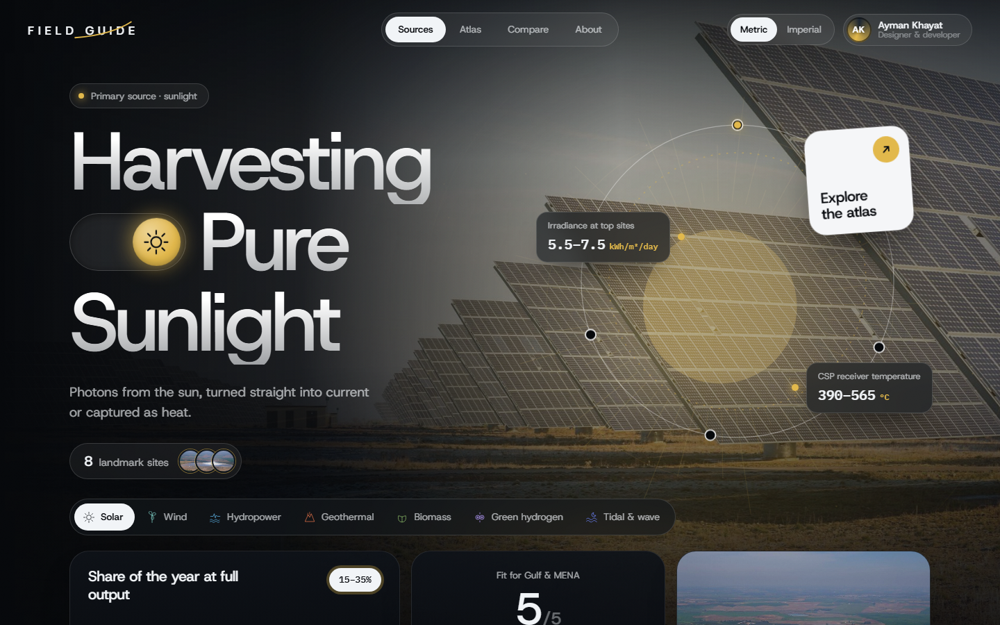

# Renewable Energy Field Guide

An interactive, cinematic guide to seven renewable energy sources: what each one is, how we harvest it, and where on Earth it works best.

**[Live Demo](DEMO_LINK_PLACEHOLDER)** · Designed and built by **Ayman Khayat**



## Features

- **Seven sources**: solar, wind, hydropower, geothermal, biomass, green hydrogen, and tidal & wave, each with its own photography, headline, and live canvas animation (solar corona, wind streamlines, electrolysis bubbles, a moonlit tide…)
- **Interactive atlas**: a draggable 3D globe or a flat map, shading countries by suitability and pinning landmark sites like NEOM, MeyGen, and The Geysers
- **Regional fit**: rate every source for eight world regions; click any country on the map to jump to its region
- **Metric / imperial toggle**: converts every physical figure (m ↔ ft, °C ↔ °F, ha ↔ acres, bar ↔ psi, and more)
- **Compare view**: all sources ranked for the selected region
- **Built with care**: responsive down to phones, keyboard-accessible, respects reduced-motion settings, and remembers your choices between visits

## Tech stack

- React 18 + TypeScript, bundled with Vite
- `d3-geo` + `topojson-client` + `world-atlas` for the globe and map (bundled, no runtime API calls)
- Canvas 2D for the per-source animations
- Plain CSS with registered custom properties for animated per-source theming

## Getting started

Requires Node.js 18+.

```bash
npm install
npm run dev
```

| Command | What it does |
| --- | --- |
| `npm run dev` | Start the dev server at http://localhost:5173 |
| `npm run build` | Type-check and build to `dist/` |
| `npm run preview` | Serve the production build locally |

No environment variables are needed.

## Project structure

```
src/
  components/   Hero, TopBar, WorldMap, Backdrop (canvas effects), sections, footer
  data/         Source content, regions, photo credits, per-source presentation
  lib/          Unit conversion, persisted state
public/images/  Optimised photography (see credits below)
```

All content lives in `src/data/`. Numeric values are stored in metric and converted at display time.

## Credits and license

Code is released under the [MIT License](LICENSE).

Photographs come from Wikimedia Commons and keep their original licenses (CC BY, CC BY-SA, FAL). Each one is credited, with its author, license, and source link, in the site footer and in [`src/data/photo-credits.json`](src/data/photo-credits.json).

Figures are typical ranges from public industry and agency sources, meant for explanation rather than project planning.
